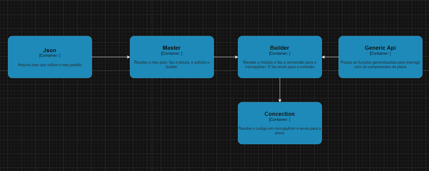

# Arquitetura Utilizada

Para o envio de codigos em micropython para a placa do BitDogLab, se optou por usar a arquitetura Builder, onde possuimos um master que recebe o json, interpreta qual o pedido e envia para o constroct builder expecifico

