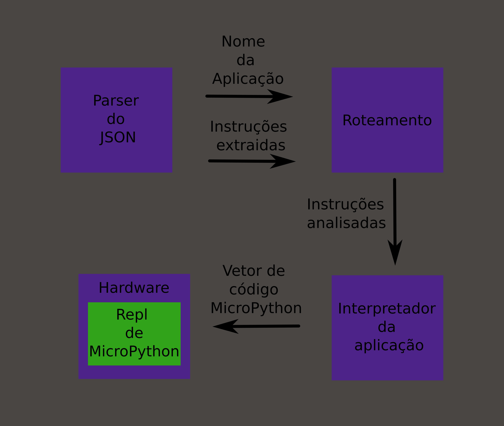

# Pasta `json` - Conversor JSON para MicroPython

Este módulo é responsável por converter instruções em formato JSON para código MicroPython, adaptando-se a diferentes aplicações. Abaixo está a documentação técnica e arquitetural.

---

## 📋 Visão Geral
O arquivo `toMicropython.ts` contém funções para transformar JSON em comandos MicroPython executáveis no client (app ou browser). A arquitetura é modular, permitindo a extensão para novas aplicações.

---

## 🛠️ Arquitetura
A estrutura segue um fluxo linear e modular:
1. **Parsing do JSON**: Extrai o nome da aplicação e suas instruções.
2. **Roteamento**: Direciona para o parser específico da aplicação.
3. **Transformação**: Gera código MicroPython personalizado para cada aplicação.

### Diagrama Simplificado:


---
#### ✨ Contribuindo com Novas Aplicações

1. **Adicione um Caso**: Em micropython(), inclua um case para sua aplicação.
2. **Crie um Parser**: Implemente uma função no estilo parseNomeDaApp(instructions).
3. **Teste**: Garanta que o código gerado seja compatível com o hardware alvo.

---
#### 📲 Módulos existentes:
1. 🟦 **NeoPixel**: Processa um lote de dados contido em um único JSON no formato:
```
{
   "neopixel": [
      {
         "pos": <string com um número indicando a posição>,
         "cor": "rgb(<número de 0 a 255>, <número de 0 a 255>, <número de 0 a 255>)"
      }
   ]
}
```
